# minecraft-26.2-datapack-resourcepack
A custom Minecraft datapack adding unique structures, custom loot and exploration content.

Created by addad156
TO USE download datapack open create world menu --> more --> data packs and throw by_addad here then move it right, for custom items/textures download resourcepack go to C:\Users\xxx(username)\AppData\Roaming\.minecraft\resourcepacks and throw it here

Screenshots
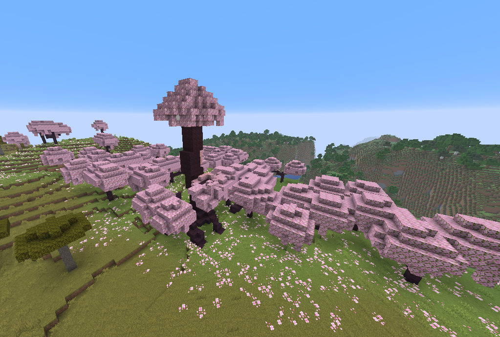

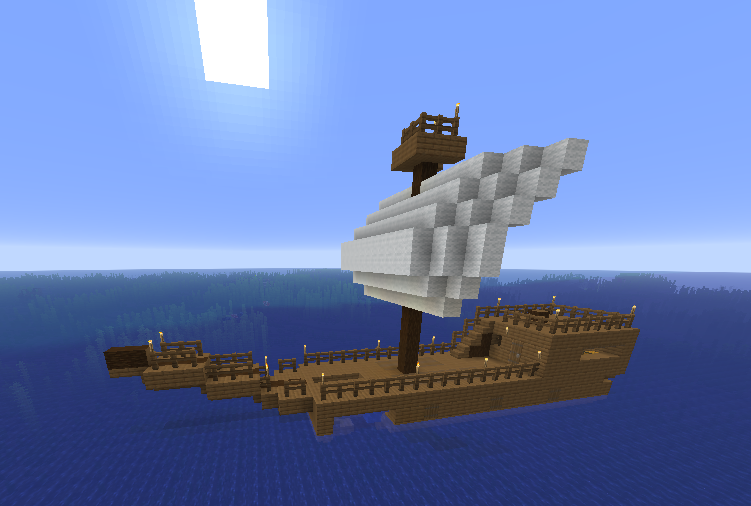

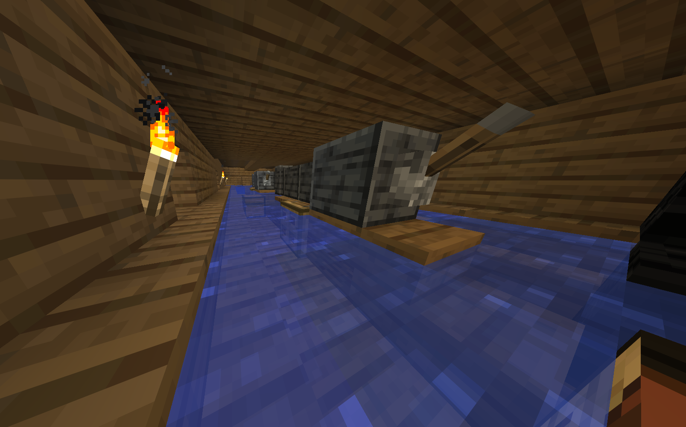

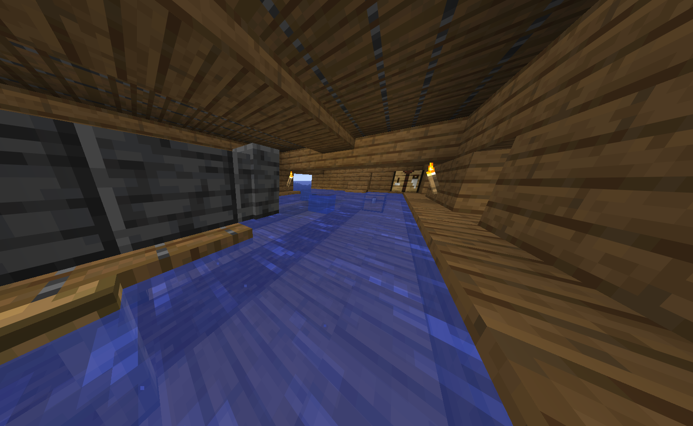

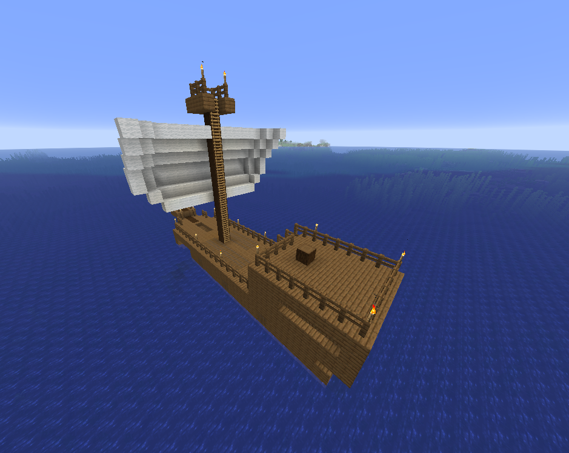

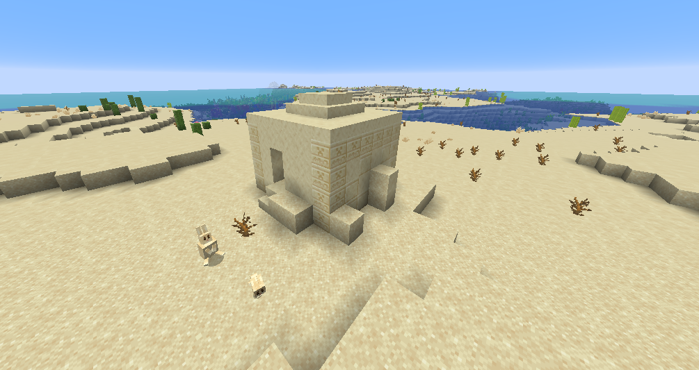

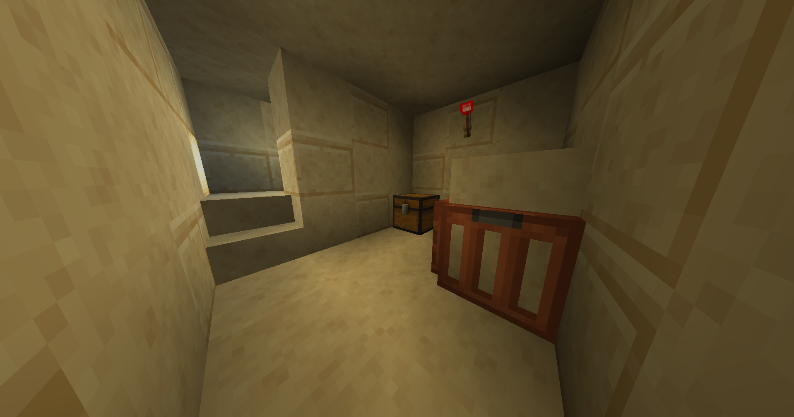

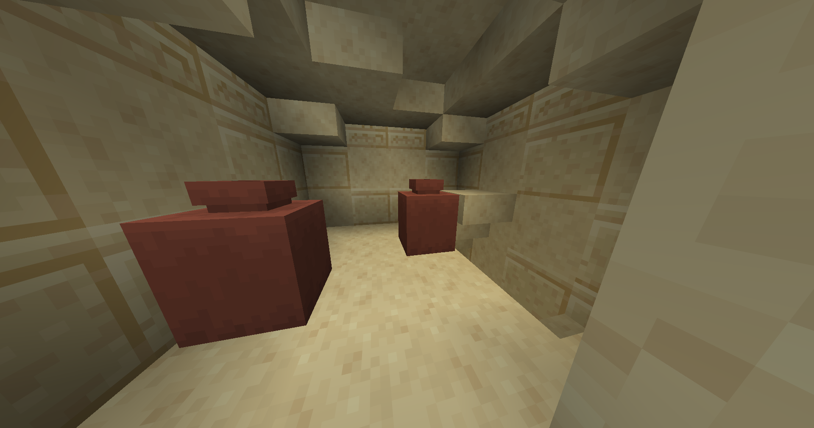

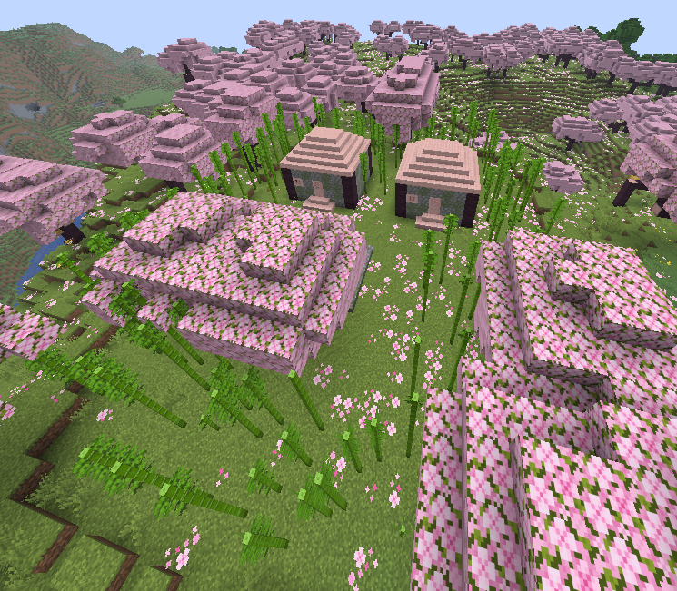

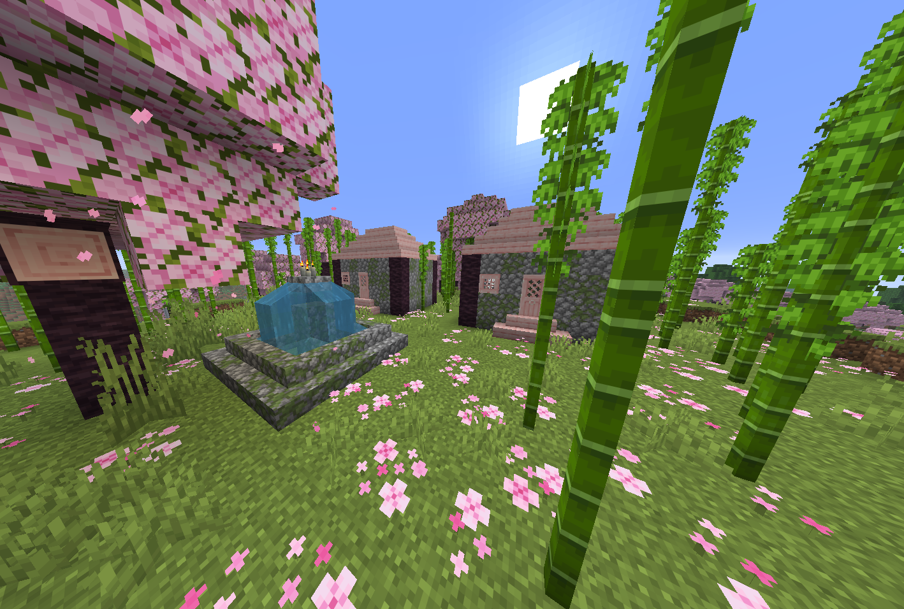

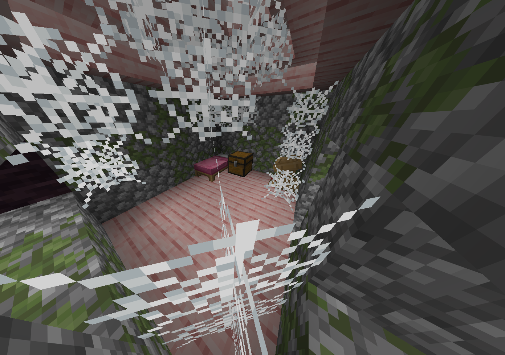

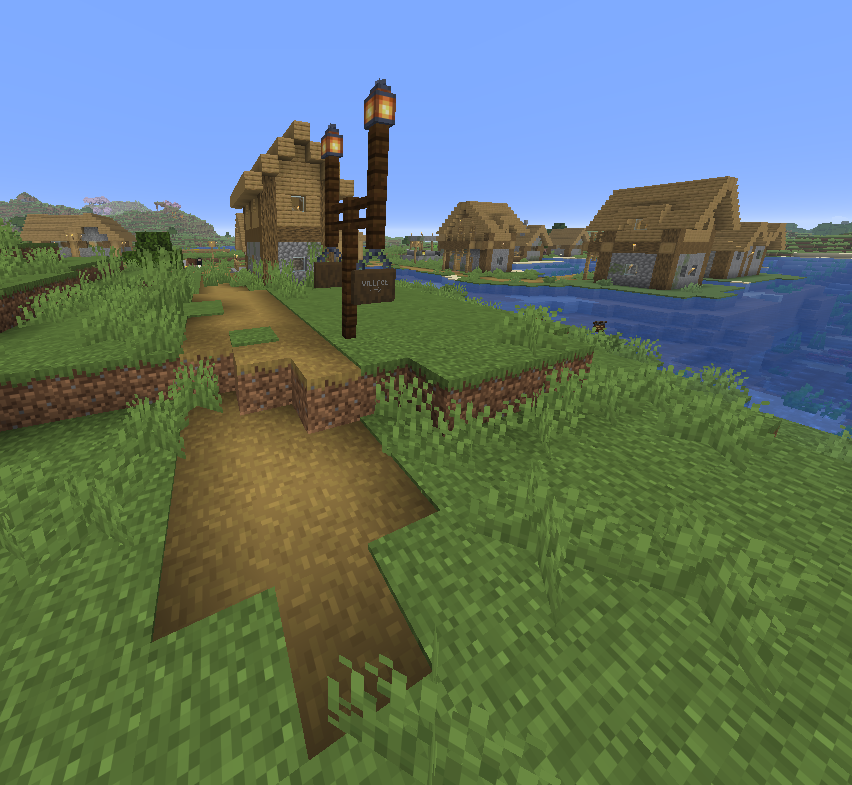

